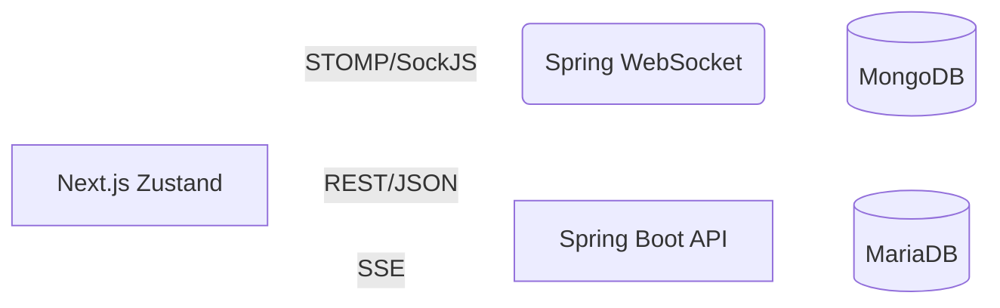

  <h1>여행 일정 공유 웹사이트[TRIPPLANNER]🌍</h1>

TripPlanner는 여행 일정을 계획하고, 실제 비용·항공편·숙소 등의 정보를 함께 기록할 수 있는 여행 공유 플랫폼입니다.  
사용자는 자신의 여행일지를 작성하고 지도 기반으로 핀을 등록하며, 다른 사람들과 댓글·채팅으로 소통할 수 있습니다.  
실시간 알림(SSE)과 WebSocket 채팅을 통해 여행자 간 상호작용 경험을 극대화했습니다.

  
  
  
  

## 📚 목차
- [개요](#-개발-기간-및-인원)
- [기술 스택 & 개발 환경](#-기술-스택--개발-환경)
- [주요 기능](#-주요-기능)
- [아키 텍처](#-아키텍처)
- [데이터베이스 ERD](#-데이터베이스-erd)
- [기술적 구현 포인트](#-기술적-구현-포인트)

## 개발 기간 및 인원

- **기간**: 2025.03 ~ 2025.10 (약 7개월)
- **참여 인원**: 1인 개인 프로젝트 (Full Stack 개발)
- **역할**: 백엔드(Spring Boot) / 프론트엔드(Next.js)

## 기술 스택 & 개발 환경

🖥️ Frontend

      

⚙️ Backend

      

🗄️ Database

     

🧰 Infra

   
 

## 주요 기능

<table> <tr> <td width="50" align="center">  </td> <td><b>회원가입 / 로그인</b> — JWT 기반 인증을 통해 안전한 사용자 로그인 및 세션 유지 기능을 제공합니다.</td> </tr> <tr> <td align="center">  </td> <td><b>여행일정 관리</b> — 사용자가 여행일정을 작성, 수정, 삭제할 수 있습니다.</td> </tr> <tr> <td align="center">  </td> <td><b>Google Maps 연동</b> — 지도에 핀을 등록하고 이미지와 함께 여행 장소를 기록할 수 있습니다.</td> </tr> <tr> <td align="center">  </td> <td><b>실시간 채팅</b> — WebSocket(STOMP)을 이용하여 여행자 간 실시간 소통을 제공합니다.</td> </tr> <tr> <td align="center">  </td> <td><b>실시간 알림</b> — SSE(Server-Sent Events) 기반으로 댓글, 좋아요 알림을 실시간으로 제공합니다.</td> </tr> <tr> <td align="center">  </td> <td><b>댓글 및 대댓글</b> — 여행일지에 댓글, 대댓글, 좋아요 기능을 지원합니다.</td> </tr> <tr> <td align="center">  </td> <td><b>게시글 검색 및 페이징</b> — 제목 및 작성자 기준으로 여행일지를 검색하고, 페이지 단위로 탐색할 수 있습니다.</td> </tr> </table>

## 아키텍처

## 데이터베이스 ERD

  

   
  📎 <a href="./images/erd_total.png">전체 ERD 보기 (클릭)</a>

ERD 설명:
 - `UserEntity` ↔ `TravelJournalEntity`: 1:N (유저별 여행일지)  
 - `TravelJournalEntity` ↔ `JournalEntity`: 1:N (일차별 일정)  
 - `JournalEntity` ↔ `PhotoEntity`: 1:N (일정별 사진)  
 - `CommentEntity` ↔ `CommentLikeEntity`: 1:N (댓글 ↔ 좋아요)  
 - `ChatRoom` ↔ `ChatRoomMember`: 1:N (방 ↔ 참여자)

## 기술적 구현 포인트

### 일반 로그인  (Username/Password + JWT)
아이디·비밀번호로 인증 후 **JWT를 발급**하여 세션리스 인증을 유지합니다.  
Spring Security의 필터 체인과 인증 컴포넌트를 커스터마이징했습니다.

---

### 전체 구조

  

---

### 로그인 과정 요약

| 단계 | 설명 |
|------|------|
| **1. 로그인 요청** | 클라이언트가 `POST /login`으로 `{ username, password }`를 전송합니다. |
| **2. 요청 진입 (Security Filters)** | `SecurityAuthenticationFilter`가 로그인 요청을 감지, 인증 시도를 시작합니다. |
| **3. 자격 증명 검증** | `UsernamePasswordAuthenticationFilter` → `AuthenticationManager`가 `UserDetailsService`를 통해 사용자 조회 및 비밀번호 검증을 수행합니다. |
| **4. 인증 성공 처리** | `SuccessfulAuth`(커스텀 핸들러)에서 인증 결과를 받아 **JWT를 생성**합니다. |
| **5. JWT 전달** | **HttpOnly 쿠키**(또는 Authorization 헤더)로 액세스 토큰을 응답합니다. |
| **6. 후속 요청 검증** | 이후 모든 보호 API 요청에서 `JWTFilter`가 토큰을 검증하고 `SecurityContextHolder`에 인증 정보를 적재합니다. |

---
### 소셜 로그인 (JWT 기반)

외부 OAuth2 인증 서버(Google 등)와 연동하여 사용자의 인증을 처리하고,  
로그인 성공 시 **JWT를 발급**하여 세션리스 인증을 구현했습니다.

---

### 전체 구조

  

---

### 로그인 과정 요약

| 단계 | 설명 |
|------|------|
| **1. 소셜 로그인 시도** | 사용자가 "소셜 로그인” 버튼을 클릭하면, 프론트엔드에서 외부 인증 서버로 리다이렉트됩니다. |
| **2. Authorization Code 발급** | 사용자가 소셜 계정으로 로그인하면, 인증 서버는 `authorization code`를 백엔드로 전달합니다. |
| **3. Access Token 요청 및 발급** | 백엔드의 `OAuth2LoginAuthenticationProvider`가 `authorization code`로 Access Token을 요청하고 발급받습니다. |
| **4. 유저 정보 조회** | 발급받은 Access Token을 이용해 외부 리소스 서버(Google User Info 등)에서 사용자 정보를 조회합니다. |
| **5. 사용자 정보 처리** | `CustomOAuth2Service`에서 DB를 조회하여 신규 유저면 저장, 기존 유저면 정보 업데이트를 수행합니다. |
| **6. JWT 발급 및 로그인 완료** | `LoginSuccessHandler`에서 JWT를 생성하고, **HttpOnly 쿠키**로 클라이언트에 전달합니다.  이후 클라이언트는 이 토큰을 사용해 보호된 API를 요청합니다. |

---

### 실시간 알림 SSE 

사용자의 댓글/답글/좋아요 등 이벤트가 발생하면 **알림을 DB에 저장**하고,  
즉시 **실시간 채널(SSE)** 로 해당 사용자에게 푸시합니다.  
프론트는 전역 스토어를 갱신하여 **알림 리스트**를 즉시 반영합니다.

---

### 전체 구조

  

---

### 🧭 동작 흐름 요약

| 단계 | 설명 |
|---|---|
| **1. 도메인 이벤트 발생** | 댓글/좋아요 등에서 `notificationService.createAndBroadcast(userId, payload)` 호출 |
| **2. 영속화** | `NotificationEntity(userId, type, refId, message, isRead, createdAt)` 를 MariaDB에 저장 |
| **3. 브로드캐스트** | 실시간 채널로 푸시  **SSE**: `NotificationSseController` 가 `SseEmitter` 로 전송 |
| **4. 프론트 수신** | `NotificationSocket/SSE Provider`가 구독 후 `notification Hook`에서 `unreadCount` 갱신 |
| **5. 읽음 처리** | 사용자가 알림을 열람하면 `/api/notifications/{id}/read` 또는 `/api/notifications/read-all` 호출 |
| **6. 동기화** | 초기 진입 시 `GET /api/notifications?cursor=...` + `GET /api/notifications/unread-count` 로 상태 동기화 |

---