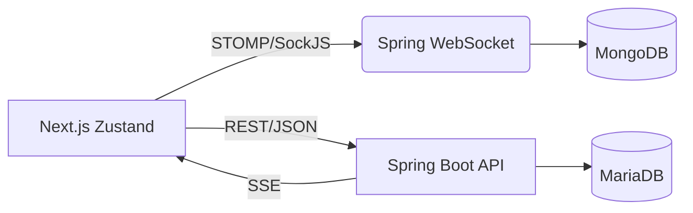

  <h1>여행 일정 공유 웹사이트[TRIPPLANNER]🌍</h1>
  
  TripPlanner는 나만의 여행 계획을 작성하고, 다른 사람들과 공유할 수 있는 웹 플랫폼입니다. 여행일정 계획을 세울 때, 실질적으로 소요되는 비용, 항공편, 숙소, 물가 등등 필수적인 사항들을 작성하고, 다른이들과 공유하며 서로의 여행의 이정표가 되었으면 합니다.

## 미리 보기

  
  

## 주요 기능

<table> <tr> <td width="50" align="center">  </td> <td><b>회원가입 / 로그인</b> — JWT 기반 인증을 통해 안전한 사용자 로그인 및 세션 유지 기능을 제공합니다.</td> </tr> <tr> <td align="center">  </td> <td><b>여행일정 관리</b> — 사용자가 여행일정을 작성, 수정, 삭제할 수 있습니다.</td> </tr> <tr> <td align="center">  </td> <td><b>Google Maps 연동</b> — 지도에 핀을 등록하고 이미지와 함께 여행 장소를 기록할 수 있습니다.</td> </tr> <tr> <td align="center">  </td> <td><b>실시간 채팅</b> — WebSocket(STOMP)을 이용하여 여행자 간 실시간 소통을 제공합니다.</td> </tr> <tr> <td align="center">  </td> <td><b>실시간 알림</b> — SSE(Server-Sent Events) 기반으로 댓글, 좋아요 알림을 실시간으로 제공합니다.</td> </tr> <tr> <td align="center">  </td> <td><b>댓글 및 대댓글</b> — 여행일지에 댓글, 대댓글, 좋아요 기능을 지원합니다.</td> </tr> <tr> <td align="center">  </td> <td><b>게시글 검색 및 페이징</b> — 제목 및 작성자 기준으로 여행일지를 검색하고, 페이지 단위로 탐색할 수 있습니다.</td> </tr> </table>

## 기술 스택

 
    <h3>Backend</h3>
     
     
     
     

    <h3>Frontend</h3>
    
    
    
    
 

 

    <h3>Database</h3>
     
     

## 아키텍처

