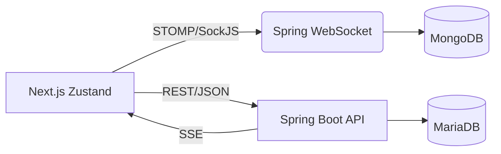

  <h1>여행 일정 공유 웹사이트[TRIPPLANNER]🌍</h1>

## 프로젝트 개요

TripPlanner는 여행 일정을 계획하고, 실제 비용·항공편·숙소 등의 정보를 함께 기록할 수 있는 여행 공유 플랫폼입니다.  
사용자는 자신의 여행일지를 작성하고 지도 기반으로 핀을 등록하며, 다른 사람들과 댓글·채팅으로 소통할 수 있습니다.  
실시간 알림(SSE)과 WebSocket 채팅을 통해 여행자 간 상호작용 경험을 극대화했습니다.

  
  

## 📆 개발 기간 및 인원

- **기간**: 2025.03 ~ 2025.10 (약 7개월)
- **참여 인원**: 1인 개인 프로젝트 (Full Stack 개발)
- **역할**: 백엔드(Spring Boot) / 프론트엔드(Next.js)

## 주요 기능

<table> <tr> <td width="50" align="center">  </td> <td><b>회원가입 / 로그인</b> — JWT 기반 인증을 통해 안전한 사용자 로그인 및 세션 유지 기능을 제공합니다.</td> </tr> <tr> <td align="center">  </td> <td><b>여행일정 관리</b> — 사용자가 여행일정을 작성, 수정, 삭제할 수 있습니다.</td> </tr> <tr> <td align="center">  </td> <td><b>Google Maps 연동</b> — 지도에 핀을 등록하고 이미지와 함께 여행 장소를 기록할 수 있습니다.</td> </tr> <tr> <td align="center">  </td> <td><b>실시간 채팅</b> — WebSocket(STOMP)을 이용하여 여행자 간 실시간 소통을 제공합니다.</td> </tr> <tr> <td align="center">  </td> <td><b>실시간 알림</b> — SSE(Server-Sent Events) 기반으로 댓글, 좋아요 알림을 실시간으로 제공합니다.</td> </tr> <tr> <td align="center">  </td> <td><b>댓글 및 대댓글</b> — 여행일지에 댓글, 대댓글, 좋아요 기능을 지원합니다.</td> </tr> <tr> <td align="center">  </td> <td><b>게시글 검색 및 페이징</b> — 제목 및 작성자 기준으로 여행일지를 검색하고, 페이지 단위로 탐색할 수 있습니다.</td> </tr> </table>

## 기술 스택 & 개발 환경

🖥️ Frontend

      

⚙️ Backend

      

🗄️ Database

     

🧰 Infra

   
 

## 아키텍처

