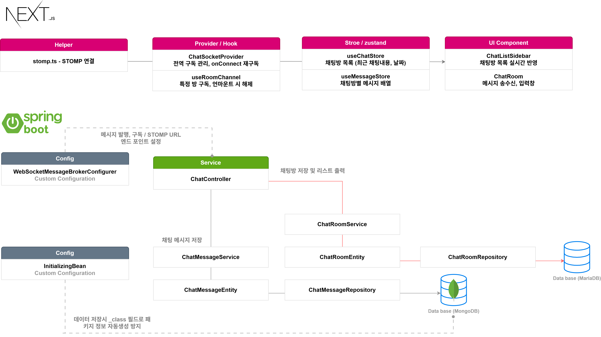

<div align="center">
  <h1>여행 일정 공유 웹사이트[TRIPPLANNER]🌍</h1>
</div>

TripPlanner는 여행 일정을 계획하고, 실제 비용·항공편·숙소 등의 정보를 함께 기록할 수 있는 여행 공유 플랫폼입니다.  
사용자는 자신의 여행일지를 작성하고 지도 기반으로 핀을 등록하며, 다른 사람들과 댓글·채팅으로 소통할 수 있습니다.  
실시간 알림(SSE)과 WebSocket 채팅을 통해 여행자 간 상호작용 경험을 극대화했습니다.


<p align="center">
  <a href="https://docs.google.com/presentation/d/1bG6nySLRsFpGKmnCHQ8BPZca14jjO9in8Ng5OueXZj8/edit?usp=sharing" target="_blank">
    
  </a>
  <a href="https://docs.google.com/presentation/d/1bG6nySLRsFpGKmnCHQ8BPZca14jjO9in8Ng5OueXZj8/edit?usp=sharing" target="_blank">
    
  </a>
  <br/>
  <a href="https://docs.google.com/presentation/d/1bG6nySLRsFpGKmnCHQ8BPZca14jjO9in8Ng5OueXZj8/edit?usp=sharing" target="_blank">
    
  </a>
  <a href="https://docs.google.com/presentation/d/1bG6nySLRsFpGKmnCHQ8BPZca14jjO9in8Ng5OueXZj8/edit?usp=sharing" target="_blank">
    
  </a>
</p>


- 자세한 홈페이지 구성 요소를 보시려면 사진을 클릭하시거나 아래 'TripPlanner Detail Google Slides' 를 클릭해 주십시오.


<p align="center">
  <a href="https://docs.google.com/presentation/d/1bG6nySLRsFpGKmnCHQ8BPZca14jjO9in8Ng5OueXZj8/edit?usp=sharing" target="_blank">
    
  </a>
</p>

-  이 프로젝트는 백엔드와 프론트엔드 레포지토리가 나뉘어져 있습니다. 백엔드 코드는 다음 주소를 참고해 주십시오.
-  백엔드 : https://github.com/JKJ0918/trip-planner-backend


## 📚 목차
- [개요](#개발-기간-및-인원)
  - [개발 기간 및 인원](#개발-기간-및-인원)
- [기술 스택 & 개발 환경](#기술-스택--개발-환경)
- [주요 기능](#주요-기능)
- [데이터베이스 ERD](#데이터베이스-erd)
- [배포](#배포)
  - [프론트엔드 - Vercel](#프론트엔드-Vercel)
  - [백엔드 - Render + Docker](#백엔드-Render--Docker)
  - [데이터베이스: Aiven(MariaDB) / MongoDB Atlas / Cloudynary](#데이터베이스)
- [기술적 구현 포인트](#⚙️-기술적-구현-포인트)
  - [일반 로그인 (Username/Password + JWT)](#⚙️-일반-로그인-usernamepassword--jwt)
  - [소셜 로그인 (JWT 기반)](#⚙️-소셜-로그인-jwt-기반)
  - [실시간 알림 SSE](#⚙️-실시간-알림-sse)
  - [게시글 작성 (Google Maps 기반 여행기 등록)](#⚙️-게시글-작성-google-maps-기반-여행기-등록)
  - [실시간 채팅 기능 WebSocket/Stomp 방식](#⚙️-실시간-채팅-기능-websocketstomp-방식)
- [🧩 트러블 슈팅 Trouble Shooting](#🧩-트러블-슈팅-trouble-shooting)
  - [채팅방 목록 실시간 반영 문제](#채팅방-목록-실시간-반영-문제)
  - [댓글 작성 시 화면 깜빡임 문제](#댓글-작성-시-화면-깜빡임-문제)
  - [이미지 업로드: 파일 선택 취소 시 기존 미리보기가 사라지는 문제](#이미지-업로드-파일-선택-취소-시-기존-미리보기가-사라지는-문제)

- 개발완료 후 업데이트(#개발완료-후-업데이트)
- [배운점 및 마무리](#배운점-및-마무리)


## 개발 기간 및 인원

- **기간**: 2025.03 ~ 2025.10 (약 7개월)
- **참여 인원**: 1인 개인 프로젝트 (Full Stack 개발)
- **역할**: 백엔드(Spring Boot) / 프론트엔드(Next.js)

## 기술 스택 & 개발 환경

<div>
🖥️ Frontend
<p>      </p>
⚙️ Backend
<p>      </p>
🗄️ Database
<p>     </p>
🧰 Infra
<p>   </p> </div>


## 주요 기능

<table> <tr> <td width="50" align="center">  </td> <td><b>회원가입 / 로그인</b> — JWT 기반 인증을 통해 안전한 사용자 로그인 및 세션 유지 기능을 제공합니다.</td> </tr> <tr> <td align="center">  </td> <td><b>여행일정 관리</b> — 사용자가 여행일정을 작성, 수정, 삭제할 수 있습니다.</td> </tr> <tr> <td align="center">  </td> <td><b>Google Maps 연동</b> — 지도에 핀을 등록하고 이미지와 함께 여행 장소를 기록할 수 있습니다.</td> </tr> <tr> <td align="center">  </td> <td><b>실시간 채팅</b> — WebSocket(STOMP)을 이용하여 여행자 간 실시간 소통을 제공합니다.</td> </tr> <tr> <td align="center">  </td> <td><b>실시간 알림</b> — SSE(Server-Sent Events) 기반으로 댓글, 좋아요 알림을 실시간으로 제공합니다.</td> </tr> <tr> <td align="center">  </td> <td><b>댓글 및 대댓글</b> — 여행일지에 댓글, 대댓글, 좋아요 기능을 지원합니다.</td> </tr> <tr> <td align="center">  </td> <td><b>게시글 검색 및 페이징</b> — 제목 및 작성자 기준으로 여행일지를 검색하고, 페이지 단위로 탐색할 수 있습니다.</td> </tr> </table>

## 데이터베이스 ERD

<div align="center">
  

  <br/>
  📎 <a href="./images/erd_total.png">전체 ERD 보기 (클릭)</a>
</div>

ERD 설명:
 - `UserEntity` ↔ `TravelJournalEntity`: 1:N (유저별 여행일지)  
 - `TravelJournalEntity` ↔ `JournalEntity`: 1:N (일차별 일정)  
 - `JournalEntity` ↔ `PhotoEntity`: 1:N (일정별 사진)  
 - `CommentEntity` ↔ `CommentLikeEntity`: 1:N (댓글 ↔ 좋아요)  
 - `ChatRoom` ↔ `ChatRoomMember`: 1:N (방 ↔ 참여자)

## 배포

본 프로젝트는 Render(백엔드) + Vercel(프론트엔드) 환경에서 배포 되었습니다. 실제 배포 환경에서 CORS, Cookie 인증, 이미지 저장소 연결, DB 외부 호스팅을 하여 스마트폰/PC 브라우저에서 직접 접속이 가능하며, 로그인·게시글 작성·이미지 업로드 등 모든 주요 기능이 동작합니다. 

빌드한 코드 내부에 API 키나 데이터 베이스 정보 등 민감한 정보를 기입하지 않고 플랫폼에서 제공하는 환경변수에 값을 넣어 보안에 신경썼습니다.


<div align="center">
  
</div>


- **Frontend:** Vercel  
  - Next.js 14 (App Router) + TypeScript  
  - 환경변수 관리, Image Optimization, API 연동  
- **Backend:** Render (Docker 기반)  
  - Spring Boot 3 + MariaDB (Aiven Cloud) + MongoDB (Atlas)  
- **Storage:** Cloudinary (이미지 업로드)
- **배포 주소:** [https://trip-planner-frontend-omega.vercel.app/](https://trip-planner-frontend-omega.vercel.app/)

### 프론트엔드 Vercel
프론트엔드의 배포 방식으로 Vercel에서 제공하는 깃허브 레포지토리와 연동하여 프론트엔드 프로젝트를 배포할 수 있는 기능을 이용하였습니다. 업데이트 사항이 있을때, 레포지토리에 업로드 한번으로 간단하게 업데이트 반영이 가능합니다.
<div align="center">
  
</div>

### 백엔드 Render+Docker
배포시 오류를 최적화 하기 위해 도커를 이용하였습니다. 빌드 파일을 도커 이미지 파일로 생성하여 도커 허브에 올렸고, 도커 허브와 Render를 연동 하여 배포하였습니다.

<p align="center">
    
    
</p>

### 데이터베이스
#### Aiven
메인 데이터 테이블을 MariaDB 형식으로 연동 하였습니다. MySQL를 제공하지만  MariaDB와 호환이 가능했습니다.

<p align="center">
    
</p>

#### MongoDB
MongoDB 에서 제공하는 플랫폼을 이용하여 서브 데이터인 대화내용을 저장하는 데이터베이스로 사용하였습니다.
<p align="center">
    
</p>


#### Cloudinary
위 두 플랫폼은 이미지 저장 공간을 제공하지 않아 외부 저장 플랫폼을 사용하여 이미지 저장공간을 확보하였습니다.
<p align="center">
    
</p>

---


## ⚙️ 기술적 구현 포인트

### ⚙️ 일반 로그인 (Username/Password + JWT)
아이디·비밀번호로 인증 후 **JWT를 발급**하여 세션리스 인증을 유지합니다.  
Spring Security의 필터 체인과 인증 컴포넌트를 커스터마이징했습니다.

---

### 전체 구조
<div align="center">
  
</div>

---

### 로그인 과정 요약

| 단계 | 설명 |
|------|------|
| **1. 로그인 요청** | 클라이언트가 `POST /login`으로 `{ username, password }`를 전송합니다. |
| **2. 요청 진입 (Security Filters)** | `SecurityAuthenticationFilter`가 로그인 요청을 감지, 인증 시도를 시작합니다. |
| **3. 자격 증명 검증** | `UsernamePasswordAuthenticationFilter` → `AuthenticationManager`가 `UserDetailsService`를 통해 사용자 조회 및 비밀번호 검증을 수행합니다. |
| **4. 인증 성공 처리** | `SuccessfulAuth`(커스텀 핸들러)에서 인증 결과를 받아 **JWT를 생성**합니다. |
| **5. JWT 전달** | **HttpOnly 쿠키**(또는 Authorization 헤더)로 액세스 토큰을 응답합니다. |
| **6. 후속 요청 검증** | 이후 모든 보호 API 요청에서 `JWTFilter`가 토큰을 검증하고 `SecurityContextHolder`에 인증 정보를 적재합니다. |

---
### ⚙️ 소셜 로그인 (JWT 기반)

외부 OAuth2 인증 서버(Google 등)와 연동하여 사용자의 인증을 처리하고,  
로그인 성공 시 **JWT를 발급**하여 세션리스 인증을 구현했습니다.

---

### 전체 구조
<div align="center">
  
</div>

---

### 로그인 과정 요약

| 단계 | 설명 |
|------|------|
| **1. 소셜 로그인 시도** | 사용자가 "소셜 로그인” 버튼을 클릭하면, 프론트엔드에서 외부 인증 서버로 리다이렉트됩니다. |
| **2. Authorization Code 발급** | 사용자가 소셜 계정으로 로그인하면, 인증 서버는 `authorization code`를 백엔드로 전달합니다. |
| **3. Access Token 요청 및 발급** | 백엔드의 `OAuth2LoginAuthenticationProvider`가 `authorization code`로 Access Token을 요청하고 발급받습니다. |
| **4. 유저 정보 조회** | 발급받은 Access Token을 이용해 외부 리소스 서버(Google User Info 등)에서 사용자 정보를 조회합니다. |
| **5. 사용자 정보 처리** | `CustomOAuth2Service`에서 DB를 조회하여 신규 유저면 저장, 기존 유저면 정보 업데이트를 수행합니다. |
| **6. JWT 발급 및 로그인 완료** | `LoginSuccessHandler`에서 JWT를 생성하고, **HttpOnly 쿠키**로 클라이언트에 전달합니다.<br> 이후 클라이언트는 이 토큰을 사용해 보호된 API를 요청합니다. |

---

### ⚙️ 실시간 알림 SSE 

사용자의 댓글/답글/좋아요 등 이벤트가 발생하면 **알림을 DB에 저장**하고,  
즉시 **실시간 채널(SSE)** 로 해당 사용자에게 푸시합니다.  
프론트는 전역 스토어를 갱신하여 **알림 리스트**를 즉시 반영합니다.

---

### 전체 구조

<p align="center">
  
</p>

---

### 동작 흐름 요약

| 단계 | 설명 |
|---|---|
| **1. 도메인 이벤트 발생** | 댓글/좋아요 등에서 `notificationService.createAndBroadcast(userId, payload)` 호출 |
| **2. 영속화** | `NotificationEntity(userId, type, refId, message, isRead, createdAt)` 를 MariaDB에 저장 |
| **3. 브로드캐스트** | 실시간 채널로 푸시<br> **SSE**`NotificationSseController` 가 `SseEmitter` 로 전송 |
| **4. 프론트 수신** | `NotificationSocket/SSE Provider`가 구독 후 `notification Hook`에서 `unreadCount` 갱신 |
| **5. 읽음 처리** | 사용자가 알림을 열람하면 `/api/notifications/{id}/read` 또는 `/api/notifications/read-all` 호출 |
---

### ⚙️ 게시글 작성 (Google Maps 기반 여행기 등록)

**Google Maps JavaScript API**를 이용해 지도 위에서 여행지 위치를 선택하고,  
사용자가 직접 **핀(Pin)** 을 찍어 여행 장소를 등록할 수 있습니다.  
입력된 지도 정보와 일정·사진·메모 등의 데이터는 DTO로 구성되어  
**백엔드(Spring Boot)** 로 전달되어 데이터베이스에 저장됩니다.

---

### 전체 구조

<p align="center">
  
</p>

---

### 동작 흐름 요약

| 단계 | 설명 |
|------|------|
| **1. 지도 불러오기** | Google Maps API를 통해 여행지 중심 좌표에 맞춘 지도를 렌더링합니다. |
| **2. 핀 등록 (Marker 생성)** | 사용자가 지도를 클릭하면 해당 위치에 **커스텀 핀**이 생성되고, 제목·메모·이미지 등을 입력할 수 있습니다. |
| **3. 상태 관리** | 등록된 핀들은 `Zustand` 전역 상태로 관리되어, 지도와 여행일정 UI가 동기화됩니다. |
| **4. 게시글 저장 요청** | 사용자가 “저장”을 클릭하면, 지도 정보(`pins`, `lat`, `lng`, `placeName` 등)와 여행일정, 이미지가 **JSON DTO** 형태로 백엔드로 전송됩니다. |
| **5. 서버 저장** | 백엔드는 DTO를 수신하여 `TravelJournalEntity` 및 관련 엔티티(`PinEntity`, `PhotoEntity`,`journalEntity` 등 )로 변환 후 **MariaDB**에 영속화합니다. |
| **6. 등록 완료** | 저장이 성공하면 프론트엔드는 `/post/{id}` 상세 페이지로 리다이렉트되어, 사용자가 작성한 지도를 포함한 여행기를 확인할 수 있습니다. |

---

### ⚙️ 실시간 채팅 기능 WebSocket/Stomp 방식

STOMP 기반 WebSocket으로 **채팅방 메시지**와 **사이드바 요약(마지막 메시지/날짜)** 를
실시간 동기화합니다. 연결 실패 시 자동 재연결 및 재구독을 처리합니다.

---

<p align="center">
  
</p>

---

### 동작 흐름 요약

| 단계 | 설명 |
|---|---|
| **1. 연결** | 클라이언트가 `/ws` 엔드포인트로 STOMP 연결. 핸드셰이크 시 인증 정보를 세션에 저장합니다. |
| **2. 구독(요약)** | 전역에서 `subscribe('/user/queue/chatrooms/summary')` → 사이드바의 마지막 메시지/미읽음 수 실시간 반영. |
| **3. 구독(방별)** | 채팅방 진입 시 `subscribe('/sub/chatroom/{roomId}')` → 새 메시지를 실시간 수신하고 목록에 append. |
| **4. 전송** | 사용자가 입력 후 `publish('/pub/message', { roomId, content })` → 서버가 저장 후 해당 방 구독자에게 브로드캐스트. |
| **5. 저장** | 메시지는 **MongoDB**(대화 로그), 방 요약(마지막 메시지/미읽음 수/마지막 읽음)은 **MariaDB** 에 반영. |
| **6. 재연결** | 네트워크 단절 시 자동 재연결 → onConnect에서 **필요 채널 재구독** 후 상태 복원. |

---

## 🧩 트러블 슈팅 Trouble Shooting

프로젝트 개발 과정에서 마주친 대표적인 문제와 그 해결 과정을 정리하였습니다.

### **채팅방 목록 실시간 반영 문제**

#### 문제 상황
채팅 메시지를 전송하면 채팅방 내부에는 실시간으로 표시되지만,  
사이드바(채팅방 요약 목록)는 최신 메시지가 반영되지 않아 즉시 업데이트되지 않음.  
변경된 채팅방 요약 데이터가 DB에 적용이 되고 있었지만, 실시간으로 UI는 갱신되지 않는 현상이 발생.

---

#### 원인 분석

React는 **상태의 “참조(주소)”가 바뀌어야 렌더링을 수행**하므로, 기존 배열/객체를 직접 수정하면 변경을 감지하지 못함.
결국 상태는 바뀌었지만 UI는 리렌더링되지 않았던 것.

---

#### 🛠️ 해결 방법

1. **백엔드 개선: `convertAndSendToUser()` 도입**  
  각 사용자의 사이드바 정보를 개별적으로 갱신하도록 구조 변경.  
  메시지 전송 시점에 사용자별 summary 데이터도 함께 전송.
   ```java
   // 채팅방 내 전체 브로드캐스트
   template.convertAndSend("/sub/chatroom/" + roomId, message);

   // 각 사용자별 사이드바 요약 데이터 전송
   template.convertAndSendToUser(userId.toString(), "/queue/chatrooms/summary", summary);
    ```
2. **프론트 엔드 개선: `convertAndSendToUser()` 도입**  
ChatSocketProvider가 /user/queue/chatrooms/summary를 구독해 수신한 DTO를 applySummary에 전달 → 전역 상태만 바꾸면 사이드바가 자동으로 갱신되는 흐름 확립.
   ```java
   // 예시: chatStore.ts 내부 개념 코드 (불변성 유지)
    applySummary: (summary) =>
      set((state) => ({
        summaries: state.summaries.map((r) =>
          r.roomId === summary.roomId
            ? { ...r, ...summary } // 새로운 객체로 교체
            : r
        ),
      }));

   ```

#### 📁 관련 코드
- `src/main/java/com/tripPlanner/project/controller/chat/ChatController.java - receiveMessage 메소드` - [메시지 수신 엔드포인트](https://github.com/JKJ0918/trip-planner-backend/blob/master/src/main/java/com/tripPlanner/project/controller/chat/ChatController.java)
- `src/main/java/com/tripPlanner/project/service/chat/ChatService.java - saveChatMessage, broadcastRoomSummaryForAll  메소드` - [저장 + 브로드캐스트 + 사용자별 요약 생성](https://github.com/JKJ0918/trip-planner-backend/blob/master/src/main/java/com/tripPlanner/project/service/chat/ChatService.java)
- `src/app/chatroom/components/ChatSocketProvider.tsx` — [실시간 요약 구독 및 상태 반영 로직](https://github.com/JKJ0918/trip-planner-frontend/blob/main/src/app/chatroom/components/ChatSocketProvider.tsx)
- `src/app/chatroom/stores/chatStore.ts` — [applySummary()를 통한 상태 업데이트 로직](https://github.com/JKJ0918/trip-planner-frontend/blob/main/src/app/chatroom/stores/chatStore.ts)
- `src/app/chatroom/components/ChatListSidebar.tsx` — [summaries 상태를 렌더링](https://github.com/JKJ0918/trip-planner-frontend/blob/main/src/app/chatroom/components/ChatListSidebar.tsx)


### **댓글 작성 시 화면 깜빡임 문제**

#### 문제 상황
댓글을 작성하면 리스트가 잠깐 사라졌다가 다시 나타나는 깜빡임(flicker) 현상이 발생.
네트워크가 느릴수록 더 두드러지며, 사용자 입력 포커스가 잦은 변경으로 불편함 초래.

---

#### 원인 분석

과거 구현(전형적인 패턴)에서는 댓글 작성 후 전체 목록 재요청을 수행해 리스트가 통째로 교체되면서 깜빡임이 발생한다는 문제 발생.

낙관적 업데이트(Optimistic Update): 새 댓글은 즉시 1페이지 맨 앞에 삽입하여(실제 응답 전) 깜빡임 없이 보이게 하고, 성공 시에는 해당 항목만 실제 서버 응답으로 교체한다. 실패 시엔 낙관 항목만 제거(국소 롤백). 이 방식이 전체 리렌더를 유발하는 “전체 재요청 → 전면 교체”를 대체함. 

키 안정화 + 메모이제이션: 각 댓글에 key={c.id}(접두 포함)로 안정된 key를 부여하고, CommentCard, CommentInput을 memo로 감싸 불필요한 재렌더링을 줄인다. 또한 답글 입력영역은 DOM을 유지(keep mounted) 하면서 hidden 클래스로만 보임/숨김을 토글해 마운트/언마운트로 인한 깜빡임을 방지함. 

---

#### 🛠️ 해결 방법

1. **전체 재요청 제거 → 국소 append로 전환**  
useInfiniteQuery 캐시를 직접 갱신해 1페이지 앞에 낙관값을 추가합니다. 성공 시 그 항목만 교체, 실패 시 그 항목만 제거.
```java

  // CommentSection.tsx Line 688 ~
  // CommentSection.tsx — 최상위 댓글 낙관 추가 → 성공 시 교체, 실패 시 롤백
  const handleAddTopComment = useCallback(async () => {

    // 1) 낙관적 추가 (id 접두로 '8' 사용 → 롤백/교체 식별)
    const optimistic: Comment = {
      id: Number(`8${Date.now()}`),
      content,
      writerName: 'Me',
      ....
    };

    // 첫 페이지 맨 앞에 삽입
    queryClient.setQueryData<{ pages: CommentPage[]; pageParams: any[] }>(
      ['comments', journalId, sortOrder],
      (old) => {
        if (!old) return old as any;
        const pages = [...old.pages];
        if (pages.length > 0) {
          pages[0] = { ...pages[0], content: [optimistic, ...pages[0].content] };
        }
        return { ...old, pages };
      }
    );

    try {
      const res = await fetch(`.../api/comments/${journalId}`, {
        method: 'POST',
        credentials: 'include',
        headers: { 'Content-Type': 'application/json' },
        body: JSON.stringify({ content }),
      });

      // 2) 성공: 낙관 항목만 실제 응답으로 교체
      if (res.ok) {
        const saved = await safeJson<Comment>(res);
        if (saved) {
          queryClient.setQueryData<{ pages: CommentPage[]; pageParams: any[] }>(
            ['comments', journalId, sortOrder],
            (old) => {
              if (!old) return old as any;
              const pages = [...old.pages];
              if (pages.length > 0) {
                const idx = pages[0].content.findIndex((c) => c.id === optimistic.id);
                if (idx >= 0) {
                  const arr = [...pages[0].content];
                  arr[idx] = saved;                 // 국소 교체
                  pages[0] = { ...pages[0], content: arr };
                }
              }
              return { ...old, pages };
            }
          );
      }

      ....

    } catch {
      // 3) 실패: 낙관 항목만 제거(롤백)
      queryClient.setQueryData<{ pages: CommentPage[]; pageParams: any[] }>(
        ['comments', journalId, sortOrder],
        (old) => {
          if (!old) return old as any;
          const pages = [...old.pages];
          if (pages.length > 0) {
            pages[0] = {
              ...pages[0],
              content: pages[0].content.filter((c) => !String(c.id).startsWith('8')),
            };
          }
          return { ...old, pages };
        }
      );
      alert('댓글 작성 실패');
    } finally {
      setLoading(false);
      setNewComment('');        // UX: 입력창 비우기
    }
  }, [journalId, newComment, queryClient]);

```

2. **자동 리패치 비활성화**  
포커스/재연결 시 전면 재패치가 발생하지 않도록 옵션을 명확히 함.

```java
  // CommentSection.tsx Line 344, 345
  useInfiniteQuery({
    refetchOnWindowFocus: false,
    refetchOnReconnect: false,
    staleTime: 60_000,
  });
```

2. **메모이즈로 리렌더 최소화**  
CommentInput/CommentCard는 memo로 감싸 필요할 때만 렌더
```java
  // CommentSection.tsx Line 40
  // CommentSection.tsx — 입력창은 memo로 감싸서 필요 시에만 리렌더
  const CommentInput = memo(function CommentInput({
    value, loading, onChange, onSubmit,
  }: {
    value: string;
    loading: boolean;
    onChange: (v: string) => void;
    onSubmit: () => void;
  }) {
    ...
  });

```

#### 📁 관련 코드
- `src/app/posts/components/CommentSection.tsx` — [무한 스크롤, 낙관 추가/교체/롤백, 메모이즈 처리](https://github.com/JKJ0918/trip-planner-frontend/blob/main/src/app/posts/components/CommentSection.tsx)


### **이미지 업로드: 파일 선택 취소 시 기존 미리보기가 사라지는 문제**

#### 문제 상황
일별 여행일지 작성 화면에서 이미지를 3장 선택한 뒤, 추가로 업로드하려고 **파일 선택창을 열었다가 ‘취소’**하면,
기존에 선택해 둔 미리보기(썸네일)들이 사라지는 문제가 발생.

---

#### 원인 분석

`<input type="file">` 의 files는 브라우저가 관리하는 일회성 상태라서 렌더/리마운트 타이밍이나 조건부 렌더에 따라 비워질 수 있음.

UI를 input.files에 직접 의존하면, onChange가 발생하지 않는 ‘취소’ 시에도 기존 프리뷰가 날아간 것처럼 보이는 부작용이 생김.

같은 파일을 다시 선택하려면 input.value = "" 리셋이 필요한데, 이 처리가 없으면 중복 선택/재선택 자체가 안 되거나 상태가 꼬일 수 있음.

---

#### 🛠️ 해결 방법

파일 입력은 소스, 화면 상태는 전역(=Zustand)에서 관리
1. UI 상태를 전부 store로 관리

    일별 초안(draft) 마다 uploadedImages 배열을 전역 상태로 보관 → 화면은 이 배열만 렌더.

    파일 다이얼로그에서 취소하면 onChange가 호출되지 않으므로, 상태 변화 없음 → 기존 썸네일 유지.

2. 파일 선택 시에만 store에 반영 & input 즉시 리셋

    파일 선택(onChange)에서 파일이 있을 때만 store에 append.

    같은 파일을 다시 고를 수 있도록 input.value = ''로 즉시 리셋.


   ```java
   // TravelJournal.tsx — Line 29 ~
   // TravelJournal.tsx — onChange에서 store 반영 후 input 리셋
    const handleImageChange = async (e, id) => {
      const files = e.target.files;
      // 취소 시: 상태 변화 없음 → 썸네일 유지
      if (!files || files.length === 0) return;           
      // store에만 반영
      await addUploadedImageToDraft(id, Array.from(files)); 
      // 동일 파일 재선택 허용
      fileInputRefs.current[id]!.value = '';               
    };
   ```

#### 📁 관련 코드
- `src/app/maps/components/TravelJournal.tsx - [파일 입력 관리, store 반영, 프리뷰 렌더, 삭제 처리(버튼)](https://github.com/JKJ0918/trip-planner-frontend/blob/main/src/app/maps/components/TravelJournal.tsx)

## 개발완료 후 업데이트
- 페이지 보완 (2025-11-14) : '이용 가이드', '문의하기' 페이지 추가
- 오류 수정(2025-12-03) : 좋아요 버튼 404 오류 fix
- 오류 수정(2025-12-04) : 게시물 수정 사진 업로드 405 오류 fix

## 배운점 및 마무리

웹페이지 구성에 있어 다양한 파트를 경험해 보고 싶어 개인 프로젝트를 진행하였습니다. 그리고, 백엔드와 프론트엔드를 모두 직접 설계하는 만큼 처음 보는 코드들도 많았습니다. 기초적인 java, javascript 문법 등과 같은 것도 중요하지만, 다양한 기능을 구현하기 위해서는 라이브러리 문법도 중요하다는 것을 배웠습니다.

요즘 AI를 이용한 vibe 코딩이라는 말이 많이 나오고 있습니다. 하지만, 프로젝트가 점점 커지면서 기본적인 라이브러리 사용법 없이는 AI 가 작성해 주는 코드만으로는 내가 원하는 구현에 한계가 있어, 지금 구현하는 것이 무엇인지에 대한 것을 공식 문서나 구글 검색 등을 이용하여 정확히 파악하는 게 중요하다는 점을 배웠습니다.

긴글 읽어 주셔서 감사합니다.